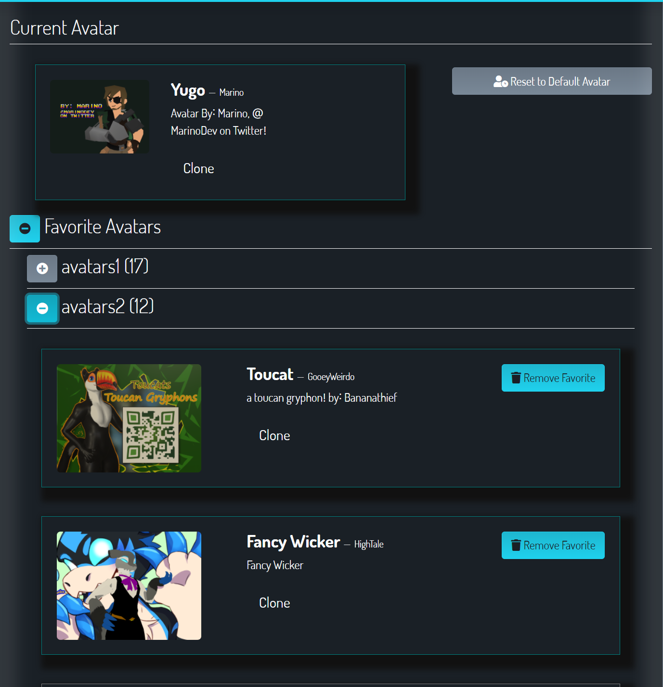
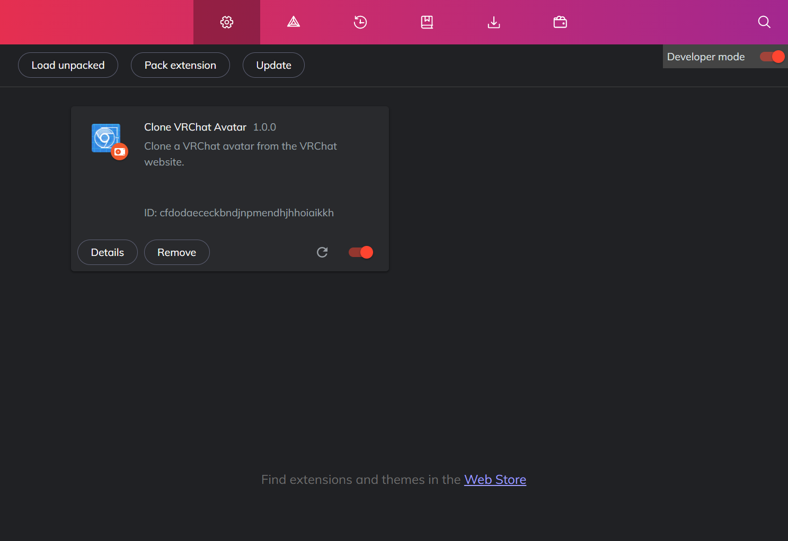

# Clone VRChat Avatar WebExtension

A Chrome browser extension that adds a "clone" button to the VRChat website on every avatar:

## Usage

1. Go to Extensions in Chrome
2. Enable "Developer mode" (top right corner)
3. Click "Load unpacked"
4. Use this folder
5. Visit VRChat website and click the "clone" button!

